# E-Commerce Store

## Description

A modern, high-performance E-Commerce frontend application built with React 19, Vite, and React Router. This application delivers a seamless shopping experience featuring advanced product filtering, dynamic sorting, cart management, wishlist, product comparisons, and a responsive UI out of the box.

## Features

- **Product Discovery:** Browse all available products with dedicated category filtering.
- **Advanced Searching & Sorting:** Dynamic sorting (by Price, Rating) and responsive category filters.
- **Dynamic Routing:** Individual product detail pages (`/products/:id`) utilizing React Router.
- **Shopping Cart Management:** Add/remove items, adjust quantities, dynamic subtotaling, and conditional shipping cost calculation.
- **Wishlist & Compare:** Save favorites to a wishlist and compare specs of different products side-by-side.
- **Dark/Light Theme:** Integrated intuitive theme toggling supporting user preferences.
- **Checkout & Orders:** Streamlined mock checkout process and comprehensive order history dashboard.
- **Responsive UI:** CSS Modules ensure scalable, aesthetic consistency across Mobile, Tablet, and Desktop.

## Tech Stack

- **Framework:** React 19
- **Build Tool:** Vite 8
- **Routing:** React Router v7
- **State Management:** React Context API + `useReducer`
- **Iconography:** Lucide React
- **Styling:** CSS Modules / Standard CSS

## Project Structure

```text
├── public/                 # Static assets
├── src/
│   ├── api/                # API service definitions (productApi.js)
│   ├── assets/             # Internal static assets
│   ├── components/         # Reusable UI components
│   ├── context/            # React Contexts (Cart, Compare, Theme, Wishlist)
│   ├── hooks/              # Custom abstraction hooks (useCart, useTheme, etc.)
│   ├── pages/              # Route-level components
│   ├── providers/          # Global application providers (AppProviders.jsx)
│   ├── routes/             # Sub-routing and route lazy loading config
│   └── utils/              # Helper utilities and constants (constant.js, helper.js)
├── eslint.config.js        # ESLint Configuration
├── index.html              # HTML Root App template
├── package.json            # Project Metadata
├── README.md               # App Documentation
└── vite.config.js          # Vite Bundler Settings
```

## Screenshots

### Home

<p align "center">
  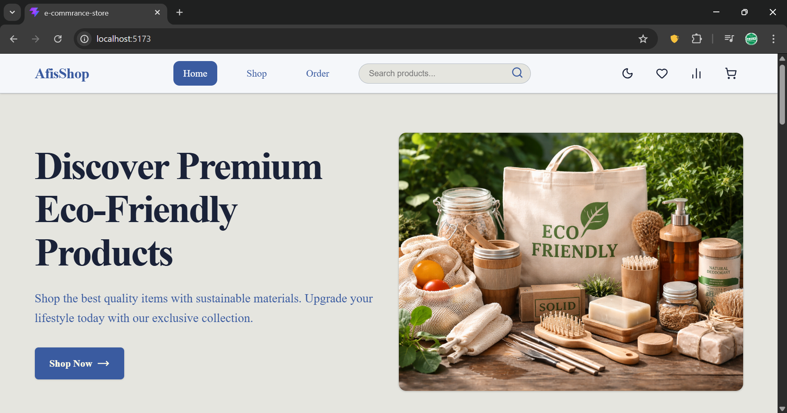
  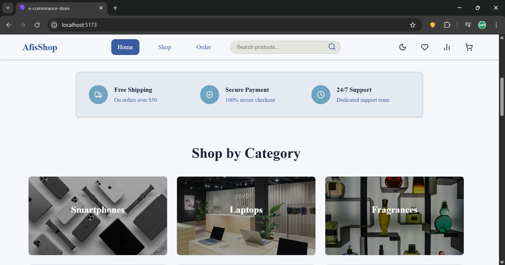
  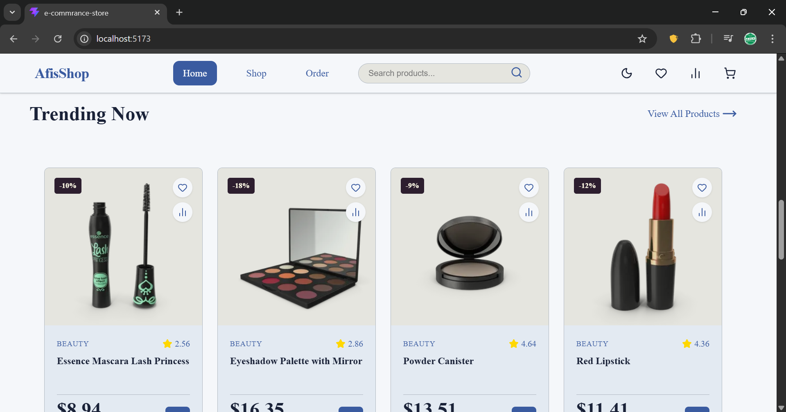
  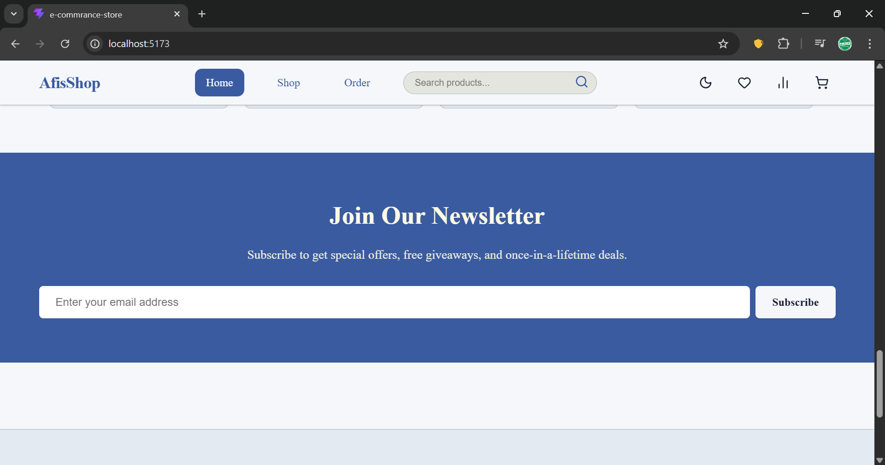
  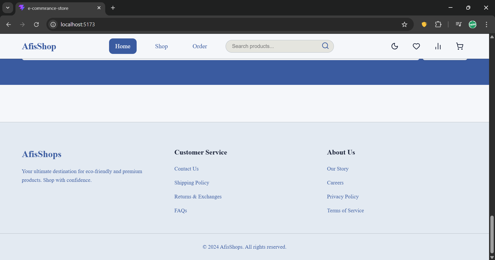
</p>

### Products

<p align "center">
  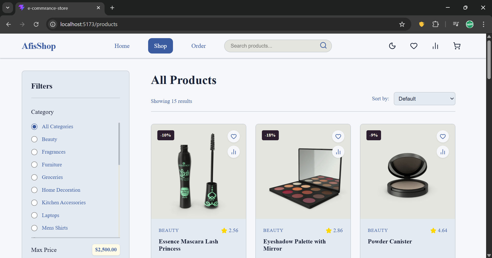
  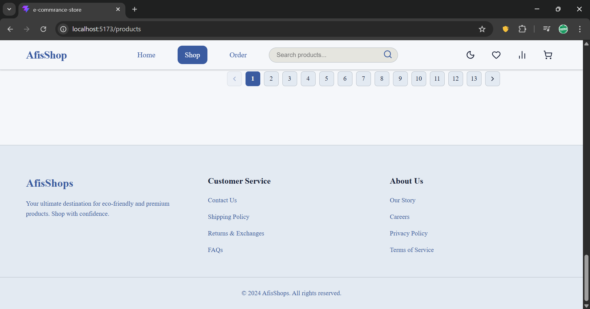
</p>

### Orders

<p align "center">
  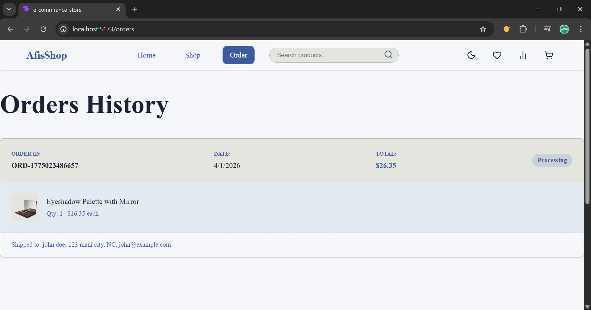
  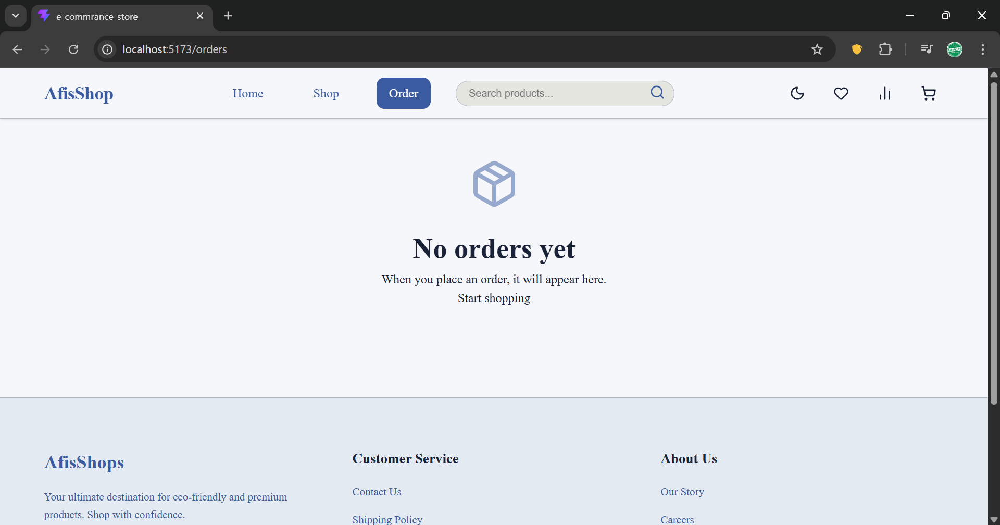
</p>

### Product Details

<p align "center">
  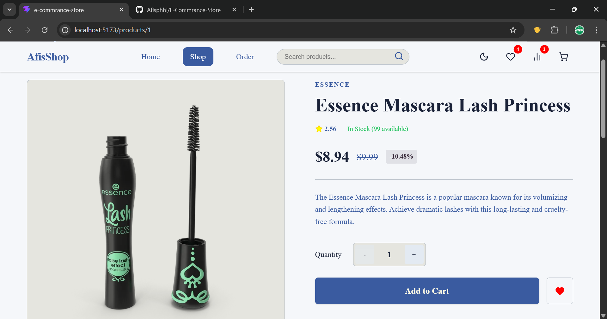
  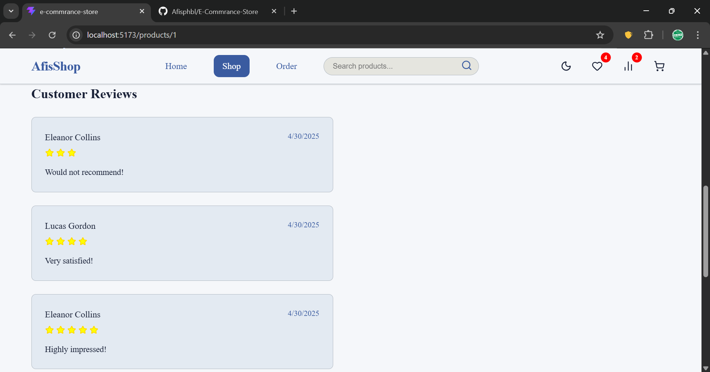

### Wishlist

<p align "center">
  
  
</p>

### Compare

<p align "center">
  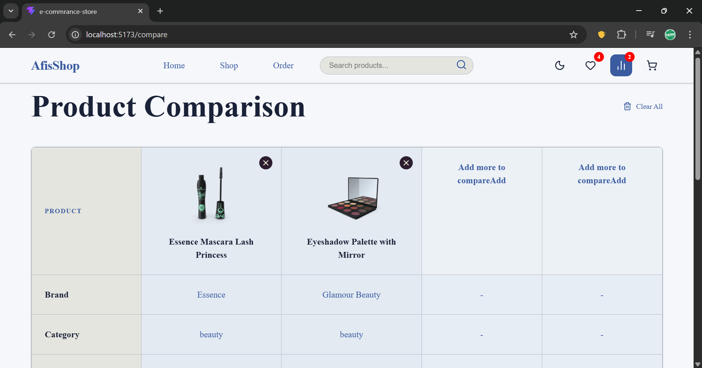
  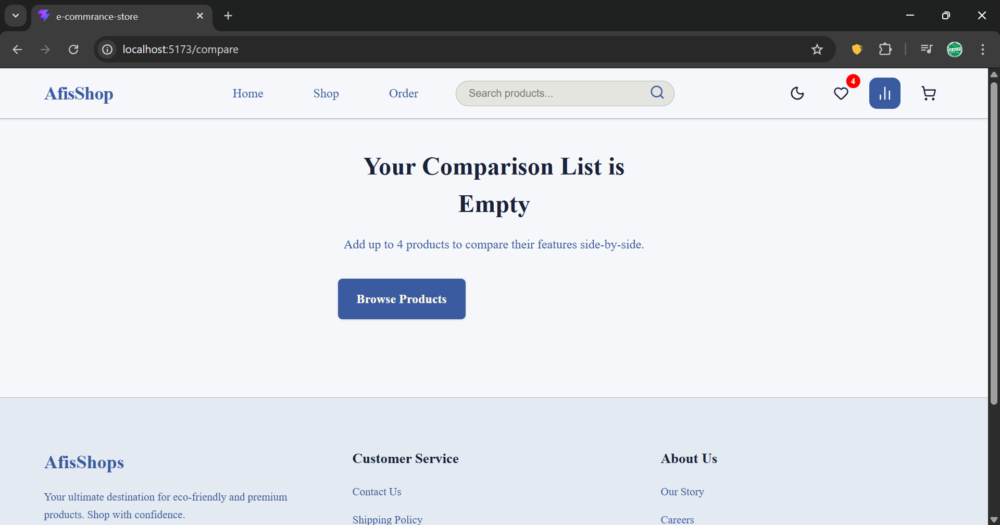
</p>

### Cart

<p align "center">
  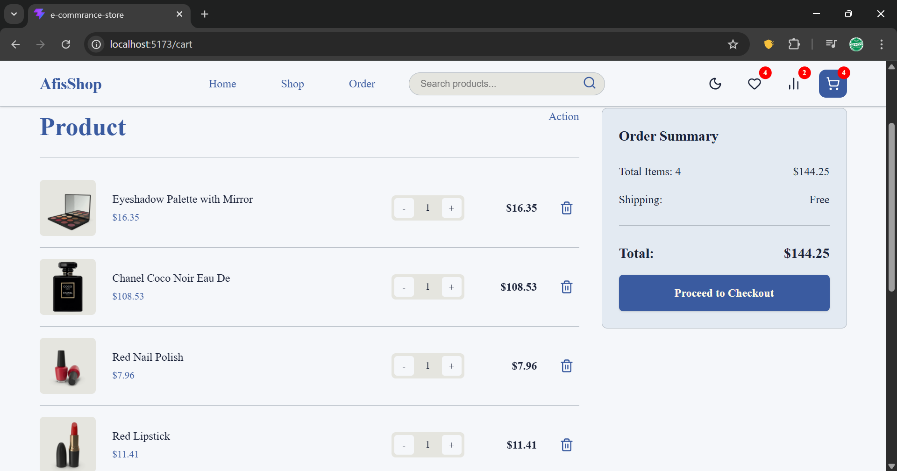
  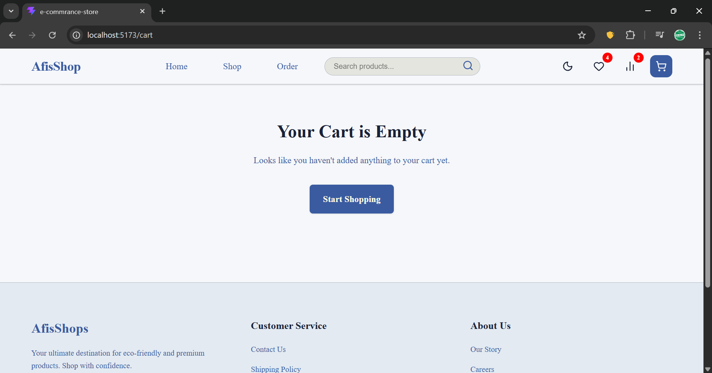
</p>

### Checkout

<p align "center">
  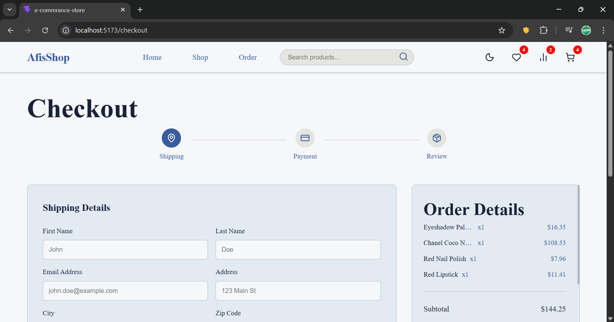
  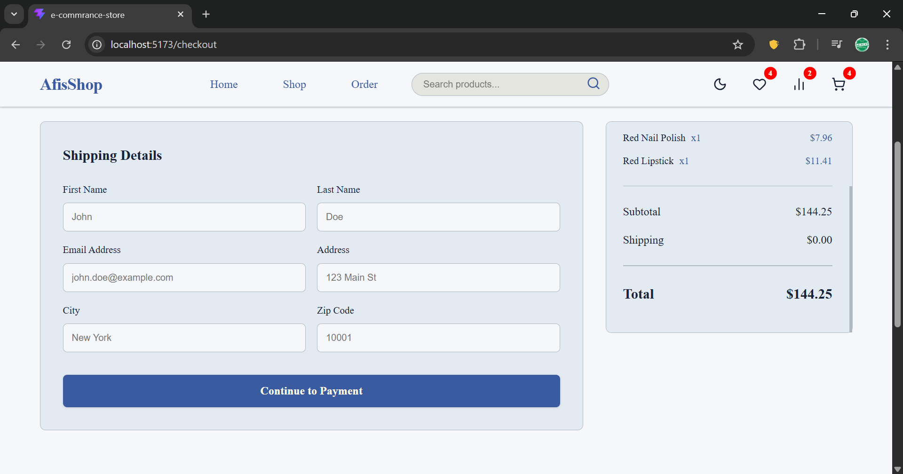
  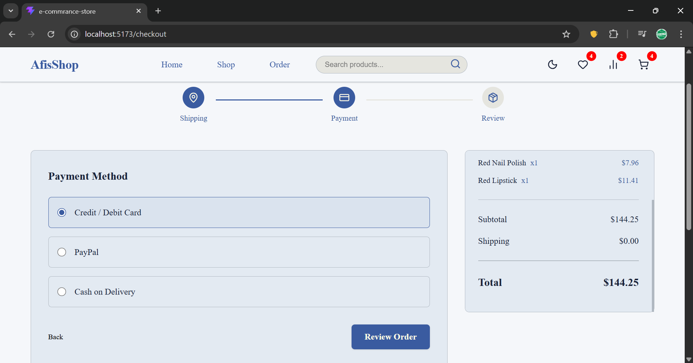
  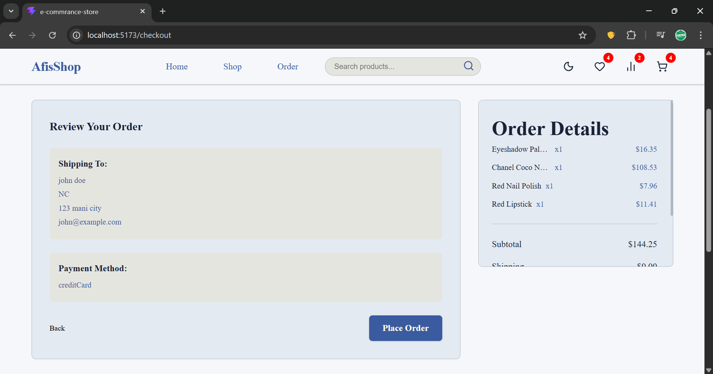
  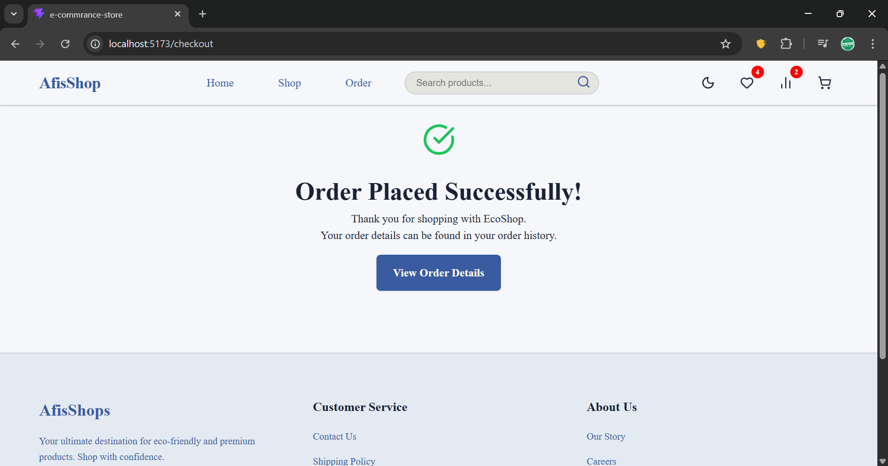
</p>

## Installation Setup

### Prerequisites

- **Node.js (v18+)**
- npm or yarn package manager

### Steps

1. **Clone the repository:**
   ```bash
   git clone https://github.com/Afisphbl/E-Commrance-Store.git
   cd E-Commrance-Store
   ```
2. **Install dependencies:**
   ```bash
   npm install
   ```
3. **Run application locally:**
   ```bash
   npm run dev
   ```

## Scripts

- `npm run dev`: Starts the Vite development server.
- `npm run build`: Generates the production-ready optimized build locally.
- `npm run lint`: Triggers ESLint across the codebase.
- `npm run preview`: Spawns a lightweight local server previewing the outputted `dist/` data.

## Author

- **Afisphbl** (https://github.com/Afisphbl)

## License

Distributed under the MIT License.
